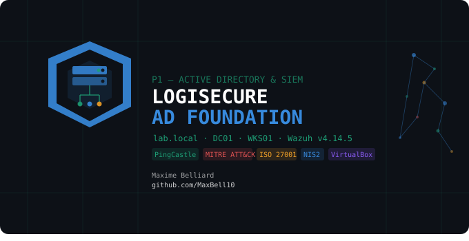
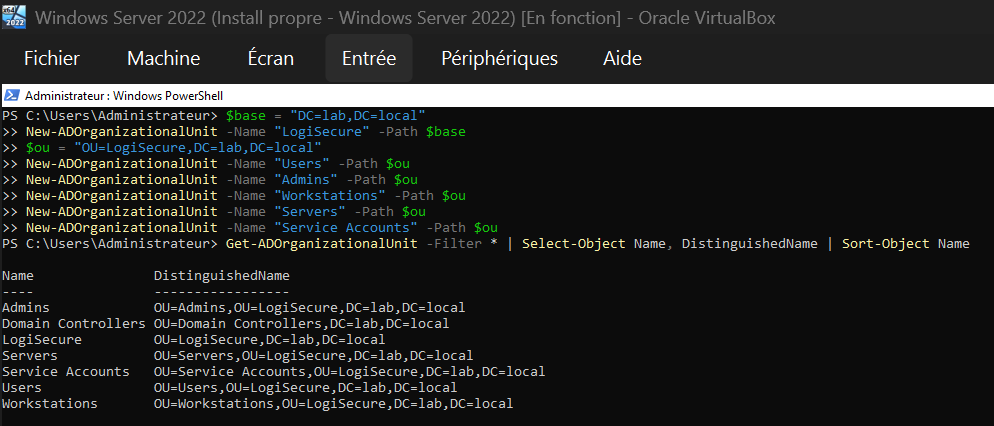
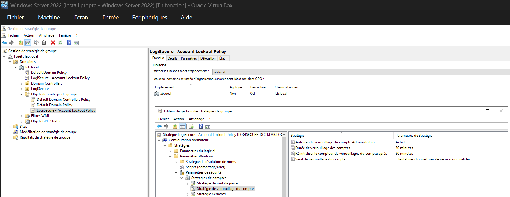
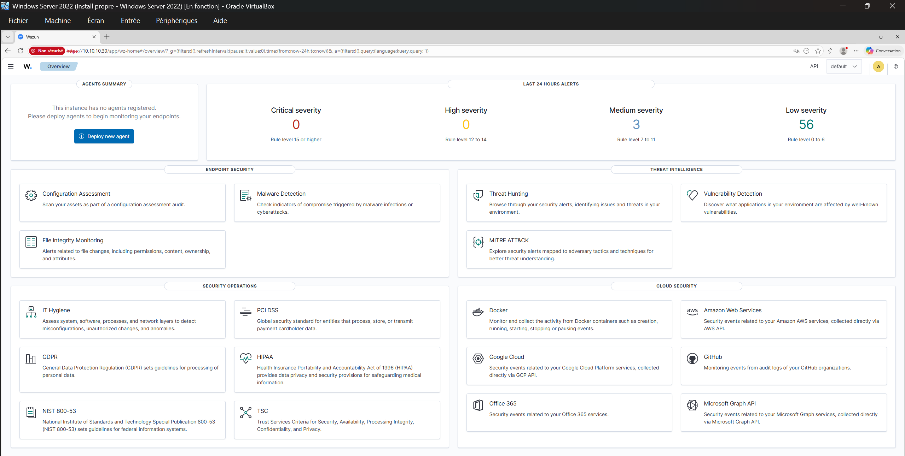
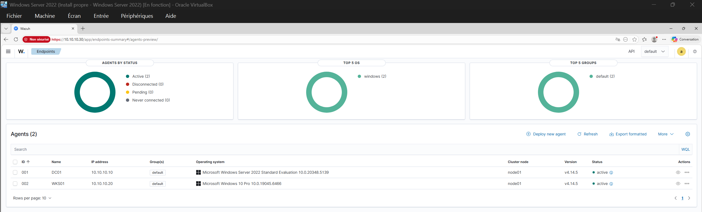
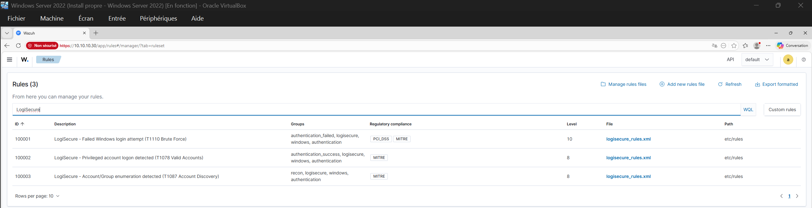
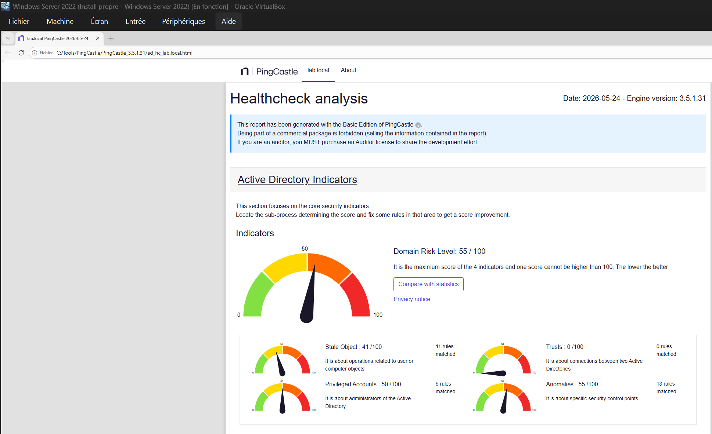
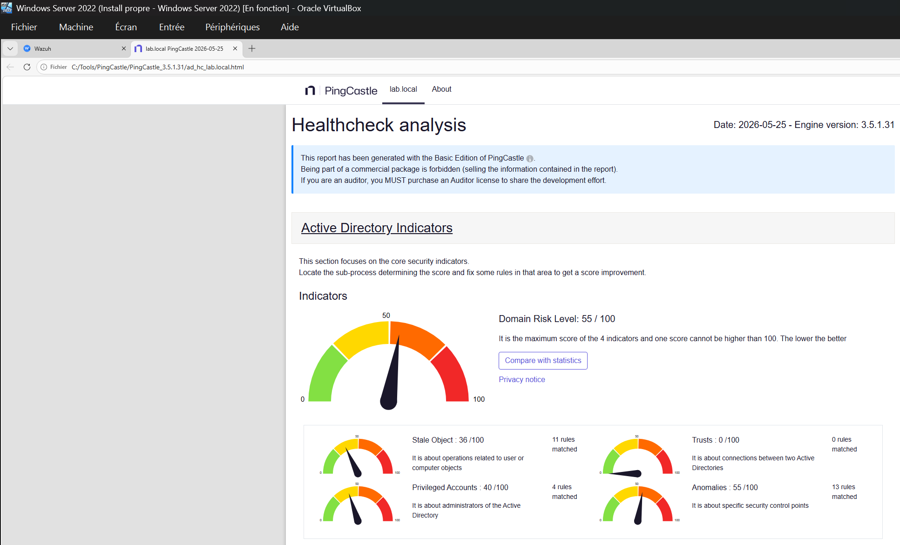

# P1 — Active Directory & SIEM Foundation



> **LogiSecure SA** · Enterprise Security Programme  
> Domaine : `lab.local` · DC01 : `10.10.10.10` · WKS01 : `10.10.10.20` · Wazuh : `10.10.10.30`

## Objectif

Construire l'infrastructure d'identité et de détection d'une entreprise belge de logistique automatisée (**LogiSecure SA**) soumise à NIS2, ISO 27001 et IEC 62443, en simulant un environnement Active Directory complet avec monitoring SIEM via Wazuh.

---

## Architecture du Lab

```
┌─────────────────────────────────────────────────────┐
│                  VirtualBox — lan-network            │
│                   (10.10.10.0/24)                    │
│                                                      │
│  ┌─────────────┐  ┌─────────────┐  ┌─────────────┐  │
│  │ DC01        │  │ WKS01       │  │ Wazuh OVA   │  │
│  │ Win Srv 2022│  │ Win 10 Pro  │  │ v4.14.5     │  │
│  │ 10.10.10.10 │  │ 10.10.10.20 │  │ 10.10.10.30 │  │
│  │ AD DS · DNS │  │ Domain      │  │ SIEM · XDR  │  │
│  │ GPO · DC    │  │ Member      │  │ Dashboard   │  │
│  └─────────────┘  └─────────────┘  └─────────────┘  │
└─────────────────────────────────────────────────────┘
        │ Adapter 1 NAT (internet)
        │ Adapter 2 lan-network (isolé)
```

| VM | OS | IP | Rôle |
|---|---|---|---|
| LOGISECURE-DC01 | Windows Server 2022 | 10.10.10.10 | Domain Controller, DNS, GPO |
| LOGISECURE-WKS01 | Windows 10 Pro | 10.10.10.20 | Poste client joint au domaine |
| LOGISECURE-WAZUH | Ubuntu (OVA) | 10.10.10.30 | Wazuh Manager + Dashboard |

---

## Ce qui a été construit

### 1. Active Directory — Domaine `lab.local`

Structure OU complète simulant une entreprise réelle :

```
lab.local
└── LogiSecure/
    ├── Users/          (5 utilisateurs métier)
    ├── Admins/         (it.admin — Domain Admin)
    ├── Workstations/   (LOGISECURE-WKS01)
    ├── Servers/
    └── Service Accounts/
```

**Utilisateurs créés :**

| Nom | Login | Titre |
|---|---|---|
| Sophie Lebrun | s.lebrun | Logistics Operator |
| Thomas Renard | t.renard | WMS Operator |
| Amina Hakimi | a.hakimi | IT Support |
| Jean-Pierre Morel | jp.morel | Operations Manager |
| Clara Devos | c.devos | Finance Analyst |
| IT Admin | it.admin | Domain Admin |



---

### 2. GPO Hardening — 4 stratégies actives

| GPO | Paramètre clé | Valeur | Référentiel |
|---|---|---|---|
| Account Lockout Policy | Seuil verrouillage | 5 tentatives | CIS / MITRE T1110 |
| Account Lockout Policy | Durée verrouillage | 30 minutes | CIS Benchmark |
| Password Policy | Longueur minimale | 12 caractères | CIS + NIS2 |
| Password Policy | Complexité | Activée | CIS Benchmark |
| Audit Policy | Événements de connexion | Réussite + Échec | MITRE T1078, T1110 |
| Security Hardening | NTLMv2 uniquement | LmCompatibilityLevel=5 | CIS Benchmark |
| Security Hardening | SMB Signing | Activé | CIS Benchmark |
| Security Hardening | LLMNR désactivé | Activé | MITRE T1557 |



---

### 3. Wazuh SIEM — 2 agents actifs

Wazuh OVA v4.14.5 déployé avec accès SSH depuis l'hôte via port forwarding NAT (2222:22). Dashboard accessible exclusivement depuis le réseau interne `lan-network` — cohérent avec une architecture zero-trust.



**Agents déployés :**

| Agent | IP | OS | Statut |
|---|---|---|---|
| DC01 | 10.10.10.10 | Windows Server 2022 | ● active |
| WKS01 | 10.10.10.20 | Windows 10 Pro | ● active |



---

### 4. Règles MITRE ATT&CK custom

3 règles LogiSecure créées dans `/var/ossec/etc/rules/logisecure_rules.xml` :

| Rule ID | Technique | Description | Level |
|---|---|---|---|
| 100001 | T1110 — Brute Force | Échec de login Windows (Event 4625) | 10 — High |
| 100002 | T1078 — Valid Accounts | Login compte privilégié (Event 4672) | 8 — Medium |
| 100003 | T1087 — Account Discovery | Énumération comptes/groupes (Events 4798, 4799) | 8 — Medium |



---

### 5. PingCastle — Évaluation de la sécurité AD

**Scan Baseline (2026-05-24) :**



**Scan After Hardening (2026-05-25) :**



**Résultats comparatifs :**

| Catégorie | Baseline | After | Delta |
|---|---|---|---|
| Stale Objects | 41/100 | 36/100 | **-5** ✅ |
| Privileged Accounts | 50/100 | 40/100 | **-10** ✅ |
| Trusts | 0/100 | 0/100 | 0 (parfait) |
| Anomalies | 55/100 | 55/100 | 0 (bloque le global) |
| **Domain Risk Level** | **55/100** | **55/100** | bloqué par Anomalies |

> Les anomalies résiduelles (pass-the-credential, network sniffing) nécessitent une PKI interne et des configurations avancées hors scope P1. Les améliorations sur Privileged Accounts (-10) et Stale Objects (-5) reflètent un durcissement réaliste et documenté.

---

## Stack technique


| Outil | Version | Usage |
|---|---|---|
| VirtualBox | 7.x | Hyperviseur |
| Windows Server 2022 | Standard Evaluation | Domain Controller |
| Windows 10 Pro | 22H2 | Workstation client |
| Wazuh OVA | 4.14.5 | SIEM / XDR |
| PingCastle | 3.5.1.31 | Audit sécurité AD |
| PowerShell | 5.1+ | Administration AD & GPO |

---

## Structure du dépôt

```
logisecure-active-directory/
├── README.md
├── p1_logo.svg
├── lessons_learned.md
└── screenshots/
    ├── 00_lab-setup/          # Config réseau VirtualBox, IP statiques
    ├── 01_ad-installation/    # Installation AD DS, promotion DC
    ├── 02_ou-users/           # Structure OU, utilisateurs, it.admin
    ├── 03_gpo-hardening/      # 4 GPOs actives
    ├── 04_wazuh-setup/        # Wazuh OVA, agents DC01 et WKS01
    ├── 05_wazuh-rules/        # Règles MITRE ATT&CK custom
    └── 06_pingcastle/         # Scans baseline et after hardening
```

---

## Statut

| # | Étape | Statut |
|---|---|---|
| 1 | Config IP + Renommage DC01 | ✅ Terminé |
| 2 | Installation AD DS + Promotion DC | ✅ Terminé |
| 3 | Structure OU + Utilisateurs | ✅ Terminé |
| 4 | GPO Hardening (4 GPOs) | ✅ Terminé |
| 5 | PingCastle Baseline (55/100) | ✅ Terminé |
| 6 | Wazuh OVA — Config réseau + Dashboard | ✅ Terminé |
| 7 | Agent Wazuh sur DC01 | ✅ Terminé |
| 8 | WKS01 — Config IP + Joint au domaine | ✅ Terminé |
| 9 | Agent Wazuh sur WKS01 | ✅ Terminé |
| 10 | Règles MITRE ATT&CK Wazuh | ✅ Terminé |
| 11 | PingCastle After Hardening | ✅ Terminé |


